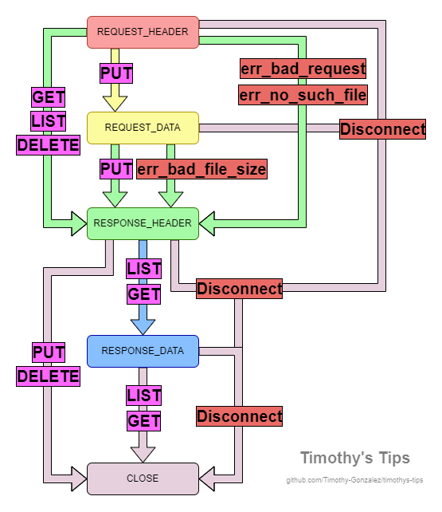

<div align = center>

# MP Nonstop Networking

[](../../README.md)
[](../README.md)
[](https://cs341.cs.illinois.edu/assignments/networking_mp.html)

</div>

# Installation

To install, download and extract the tar from the [latest release](https://github.com/Timothy-Gonzalez/timothys-tips/releases/latest):

```sh
curl -sSL https://github.com/Timothy-Gonzalez/timothys-tips/releases/latest/download/cs341-mp-nonstop-networking.tar | tar -xv
```

# Usage

1. A visual debugger and several tasks are provided
2. The debugger can be used by using the debugging tab in vscode like normal
3. Tasks can be run using `Ctrl + Shift + P > Run Task`
4. **Additionally, test files are provided of 3 sizes**
   - [test_files/hello.txt](test_files/hello.txt) is a simple small "Hello, world!" file
   - [test_files/harrypotter.txt](test_files/harrypotter.txt) is a medium sized text file - the entire first book of Harry Potter
   - [test_files/tacos.mp4](test_files/tacos.mp4) is a large video file - this should be your "everything works properly" stress test
   - I recommend starting with the smallest, and once that works work your way up the list
5. Last but not least, **several test scripts are provided**
   - [tests](tests) is where you can find the tests. See inside each file for specifics, this is just the overview.
   - I'll mention which tests are useful where in the tips, also.
   - [tests/put_get.sh](tests/put_get.sh) makes a single put, then get, and validates whether both worked. The size can be specified.
   - [tests/multi_put_get.sh](tests/multi_put_get.sh) makes, you guessed it, multiple puts and then gets!
     This is essentially equivalent to running `put_get.sh` for sizes from 2 bytes to 2 gigabytes.
   - [tests/very_many_put.sh](tests/very_many_put.sh) makes multiple puts, but at the same time.
     The number of clients and size of requests can be specified. This is good for the AG's `Very Many Client Put Test`.
   - [tests/stress_test.sh](tests/stress_test.sh) does puts, lists, gets, and deletes.
     The number of clients and size of requests can be specified. This is good for the AG's `Stress Test`.

# Part 1 Tips

- Stop. Breath. Read the [MP page](https://cs341.cs.illinois.edu/assignments/networking_mp.html) fully.
  Read everything thoroughly. Yes, this is part 1, but you still need to know the rest so you can integrate everything together.
  Yes, it's a lot of work, but you will NOT regret it. (I promise c:)
  - You might also find the [coursebook resource on networking](https://cs341.cs.illinois.edu/coursebook/Networking) helpful.
  - If you haven't done the [Charming Chatroom](https://cs341.cs.illinois.edu/assignments/charming_chatroom.html) lab,
    you should, as a lot of the code is reusable, especially for part 1.
  - Do you know what the 4 methods you to to implement are?
  - Which methods require sending raw binary data?
  - Which methods require receiving raw binary data?
  - What is an "error" and how do you handle it?
  - Do you know how to traverse through the results of `getaddrinfo`, make a socket, and connect to it?
  - How do you handle `EINTR`? When do you have to handle it?
  - When should you `shutdown`? It's not just once at the end!
  - **If you can't answer the above, go find the answer!** You **_should_ know these** from the three links above!
- **Part 1 is not that difficult,** _but_ you can **make** it difficult if you ignore the numerous resources above.
  Also, if you somehow haven't used a debugger yet, this is the mp to learn (it takes 10 minutes, and saves hundreds). **Good luck!**
- Before you begin, I'd recommend looking at [format.h](format.h) and [common.h](common.h) to see what you have to work with
  - Most of what you have is formatters which **you have to use**
  - You can **implement shared methods** between server and client in [common.h](common.h)!
- First things first, you have two references to play with: `server-reference` and `client-reference`.
  These are **very** useful for testing your server/client with without worrying about having to implement a correct implementation of the other!
  Spend some time playing around with them using the examples from the [MP page](https://cs341.cs.illinois.edu/assignments/networking_mp.html)!
- After you understand the task at hand - start with the basics - parse your arguments & put them all into nice variables you can use later.
  - It's also **really helpful for this MP to have a bunch of logging** - **you won't get penalized for it** - see the provided `LOG` macro
- Once you've done that - connect to the server. You can verify this works by checking the output from `server-reference`.
- Now we can begin. The easiest method you should begin with is `LIST`.
  `LIST` is simple - just send a request to the server, print out the response.
  - To easily test this, you'll need to add a few files.
    I recommend starting up a `server-reference` to test with, and a `client-reference` to add the files.
  - It might be helpful to break each request into two parts - **requesting from the server**, and **getting a response from the server**
    - **TIP:** Make helper functions! Make your life easier! Your main method can be:
      1. Parse arguments
      2. Make request
      3. Get response
      4. Cleanup
  - For the `LIST` request, you don't need to send and binary data - you just need to send the `LIST` verb and a newline.
    See the [MP page](https://cs341.cs.illinois.edu/assignments/networking_mp.html) for specific examples.
    - Make sure you tell the server you are done making your request! You should send a EOF using `shutdown`.
      **You do not call shutdown only once at the end**! Check the [MP page](https://cs341.cs.illinois.edu/assignments/networking_mp.html)!
  - For responses, you need to first check if the request was a success (`OK`), or had an error (`ERROR`).
    - **Note: You MUST handle invalid headers**. This means if the header does not begin with `OK\n` or `ERROR\n`,
      you should stop processing the response and use the relevant format function.
    - If it's an `ERROR`, there can be an error message afterwards.
      **You need to handle this**, and send it to the relevant format function if `ERROR`.
  - For the `LIST` response, after the header you get the message size (encoded as a `size_t`), and the following message.
    - Make sure you read the size correctly! It will always be 8 bytes after the header.
    - When reading the message, make sure you handle the same problems from Charming Chatroom
      - Reads **can fail**
      - You need to handle `EINTR`
    - If the message you read is **too little**, as in `read < expected_size`, call the relevant format function
    - If the message you read it **too large**, as in `read > expected_size`, call the relevant format function
      - Hint: <details><summary></summary>
        If you only ever request `expected_size` bytes, read will only give you that many. How can you check if the server sent more data?
        </details>
      - Hint hint: <details><summary></summary>
        What happens when we request `expected_size + 1` bytes?
        </details>
    - If the message you read is just right, print it out. You're done!
- Next, I'd recommend `DELETE`.
  - For the `DELETE` request, you don't need to send binary data - what do you need to send? (Look at the [MP page](https://cs341.cs.illinois.edu/assignments/networking_mp.html)!!)
  - For the `DELETE` response, you don't need to handle any binary data - just call the right format function if it succeeds
  - If you **haven't implemented error handling** - now is a perfect time. Trying to `DELETE` a file that doesn't exist gives an error.
- And finally, you have `GET` and `PUT`
  - These two methods are opposites, but have a lot in similar.
  - For the `GET` **request**, you need to specify which file.
  - For the `GET` **response**, you need to read the size & write to a file.
  - For the `PUT` **request**, you need to read from a file and send the size of it & the binary data of that file.
  - For the `PUT` **response**, you need to call the right format function.
  - Make sure you're reading & writing properly, and **send the size before** you send any binary data.
    **Make sure you read the size** before you read any binary data.

# Part 2 Tips

- Prepare yourself. Part 2 is significantly more involved than part 1, but doable.
  I don't like to say "hard" or "easy" because those are very relative terms, so I'll say part 2 is very implementation heavy,
  like shell, where there's a lot of tiny details you have to get right,
  but like malloc, where it can be difficult to debug what is wrong.
- You only need 50% for Part 2. Part 3 will require everything to work. These tips will cover the 100% for Part 2.
  Part 3 will cover the Part 3 specific stress tests.
- If you got by Part 1 by skimming the [MP page](https://cs341.cs.illinois.edu/assignments/networking_mp.html),
  stop, and actually re-read it.
  You will have a bad time with Part 2 if you don't understand what you are doing.
  Additionally, you should read the [coursebook resource on non-blocking IO](https://cs341.cs.illinois.edu/coursebook/Networking#non-blocking-io).
  - **You should be able to answer the following questions**. If you can't, you will have a bad time.
  - What is epoll? Why do we need it?
  - What is the difference between level triggered and edge triggered? What are the advantages to each?
  - How do we know if read/write will block?
- First things first, you **need to plan this MP out**. I would strongly recommend diagramming a state machine.
  - **Why?**
  - Unlike with the client, it's not as simple as just read-everything and write-everything.
    One of your read/writes might be interrupted, and you'll have to come back to it later.
  - For example, say you have a 2048 byte file. You write 924 bytes of it, and then write blocks.
    Since our server is single-threaded and we are using non-blocking io, we can't just wait for it to stop blocking.
    That's epoll's job. In the mean time, we have to move on the next connection and come back later.
  - As such, **each connection must maintain a state of some sort**.
  - Some methods share some functionality, so you want your state machine to share some states with different methods.
    Think of states as functions.
    **Each connection will need to maintain metadata** about it's state, and probably other things depending on your implementation.
    Think about what metadata you need to store.
  - Some ideas to get you started:
    - All requests require reading the header (could be a start state)
    - Only `PUT` requires reading the request's binary data
    - All requests (even ones that error!) require responding with a header
    - Only `GET` and `LIST` require responding with binary data
    - All requests must be closed (could be an end state)
  - For reference, here's my state diagram. **Yours could be different**, but it will likely be similar.
    - 
    - Each state corresponds to a color. The verbs are in purple, while any bad states (errors and disconnects) are red.
    - Disconnect just means when we can no longer read/write or the client disconnects -
      for example SIGPIPE (which you should catch) will cause later read/writes to error instead.
    - If you want to make your own, this was made with [draw.io](https://draw.io)
- After you've planned things out, I'd recommend first getting the base boilerplate code down.
  This is parsing arguments, creating the temp directory, starting the server, setting up epoll, and finally cleaning everything up.
  - **Make everything modular!** The key to this MP is good organization and splitting up logic into functions.
    **If a function has more than one main purpose, it should be two functions.**
  - For creating the temp directory, read the
    [MP page](https://cs341.cs.illinois.edu/assignments/networking_mp.html) for the exact way you should do it.
    **If you fail to create & print out the temp directory properly, you will fail all tests**.
  - Creating the server is almost the exact same logic as the [Charming Chatroom](https://cs341.cs.illinois.edu/assignments/charming_chatroom.html) lab,
    **but make sure you make it non-blocking**. When working with epoll, everything should be non-blocking.
    Make sure you apply the non-blocking flag to the socket.
    (For the specifics, see the man page, there are some cases where it's not _needed_, but most likely you need it)
  - For this stage don't worry about any connections yet -
    just try to take the [coursebook example](https://cs341.cs.illinois.edu/coursebook/Networking#non-blocking-io) on epoll,
    and go from there. Note: this is taken from the man page for epoll, which is a good read after the coursebook.
  - I recommend setting up `SIGINT` handling early - it's very simple and allows you to implement cleanup.
    Your signal handler just needs to set a flag for your `epoll_wait` loop to know it's time to stop.
    Remember, on a signal, sys calls like `epoll_wait` will error with `EINTR`. This allows you to exit your `epoll_wait` loop.
    Deleting the temp directories created is annoying, so implement the cleanup before anything else so you don't have to.
- Now, it's time to get into the meat of this MP.
- Once you have epoll setup, you should have some generic `handle_connection` method, that takes in an fd.
  Each connection will need metadata to track it's state, along with other info that depends on your implementation.
- **Make sure you set new connections to be non-blocking**. The man page references `setnonblocking`, but that's not a real function.
  You might find `fcntl` helpful.
- **Important note:** Each of the below cover a major part of parsing, and cover each method.
  To start, I'd recommend implementing everything you need for ONE specific method, and then add the rest as you test it out.
  **Test as you implement!** If you wait till the end, you'll have a huge amount of code to test.
  If you test incrementally, you only need to worry about a few lines.
- The first thing you'll need to do regardless of method is implement request header parsing.
  - Remember, a valid header cannot have a filename longer that 512 character as per MP spec.
    This means there is a maximum header size.
  - A valid header must be terminated with a `\n`. If you do not find one in that maximum header, you have a problem.
  - Note `err_bad_request` in [format.h](format.h). If you get a bad request, you should return an error header with that error message.
  - `err_no_such_file` is for `GET`/`DELETE` requests that reference a file that doesn't exist.
  - If you do states properly, error handling is as simple as setting an error field on the connection metadata,
    and changing the state to go to the response header.
  - Be very careful about reading too much. You don't want later binary data handling to be messed up!
  - Make sure you handle blocking! The client might send part of the request, and then block before sending the rest!
    - You may need to modify your `read_retry` and `write_retry` from the client code to handle blocking!
    - `errno` will be set to specific values on a block! Read the coursebook and man pages!
  - If you don't handle blocking, you will busy-wait, which means you won't be supporting multiple clients!
- Next, you should implement response header sending. Note, for `PUT` you'll need to handle request data first,
  but I'm skipping that for now as you want to get something basic working first!
  You can always lie and say the request succeeded, which makes testing the basic functionality easier!
  - Response headers are pretty simple - depending on what happened earlier, you're either sending `OK\n` or`ERROR\n<err msg>\n`.
  - Keep in mind what you'll do if any of this blocks - blocking can happen at any time for a load of reasons.
- Now that you've tested the basic behavior and verified it works, it's time to handle binary data.
  You need to implement `PUT` first, as testing `LIST` and `GET` without files on the server is hard.
  This means reading the request data.
  - When reading the request header, if the method is put, the next state should be reading the request data.
  - You should read the size first, then the data.
  - **You cannot load the entire request data into memory**.
    Firstly, some files are larger than memory. Secondly, **larger files will almost always block**.
    Networks are slower than local io, and the socket can get backed up.
  - As such, you'll need to read a bit of the request data, save it to disk,
    and then come back later when there's more to read (with the magic of `epoll`).
  - **Note you need to handle the client sending too much or too little data**.
    This is similar to the logic you did with the client, but across multiple reads after multiple blocks.
    - The `err_bad_file_size` [format.h](format.h) error should be sent in this case.
    - **The file should also be deleted in a failed `PUT` request!**
  - After you implement this, you can test `PUT` and `DELETE`!
    Try uploading large files and diffing the uploaded content with the original. [test_files](./test_files/) may be helpful.
    You'll also want to test MUCH larger files eventually, for the very large test. I'll explain this later.
- Finally, you need to handle sending binary data - the response data.
  - The logic for this is essentially request data, but reversed.
  - First things first, you need to calculate the size of your response data.
    - For `GET`, this is easy - `fstat`.
    - For `LIST`, this is 0 if there are no files, or `sum(file_name_lengths) + num_files - 1` if there are.
      **Note that newlines are sent for every file line except the last**.
  - For `GET`, you are just reading in the file and sending it. Be careful with keeping your read and what you send in sync.
    If you read in 1024 bytes of a file, you can't just send 956 and then read in another 1024 bytes of a file, or you'll miss data.
  - For `LIST`, it's a little more tricky. Because of the max filename requirement, I'd recommend sending one file at a time.
    - You'll have to keep track of how many filenames you've sent so far (metadata)
- So, now you're done? Not quite yet. **You need to test!!** There are a couple things you should test:
  - All methods should work!
  - `SIGPIPE` shouldn't kill your server.
  - If a read/write errors, close the connection. Do not send an error, as you can't.
  - Make sure your error responses work. Bad requests should error, `DELETE`ing a invalid file should error.
  - You should clean up the temp directory when the server is `SIGINT`'d! My provided tests assume you do as an incentive!
  - Test too much / too little data.
    The easiest way to do this is modify your client to say that size is +1 or -1 that the actual size.
  - You should test `PUT`/`GET` with extremely large files. One of the tests tests `4096 MB` (much larger than memory).
    - Note **this may mean modifying your client if it currently reads the entire file into memory** before writing it.
    - I have provided [tests](./tests/) for this. **See [Installation](#installation) to download them.**
    - To test your put and get, I'd recommend first running:
    - [tests/multi_put_get.sh](./tests/multi_put_get.sh), which will do PUTs and GETs from `2` bytes to `2G`.
      This is a good stress test to see if your server and client can handle large files,
      and will let you know what to test with the next test.
    - [tests/put_get.sh](./tests/put_get.sh) is a single-size version of the many one.
      It lets you test a specific sized PUT-GET.
- After you've thoroughly tested everything at least three times, submit to the autograder and pray.
  If you test well, you should catch most errors, but this is a large MP and it's easy to miss a small detail.
  Debugging is your biggest enemy and friend!

# Part 3 Tips

- At this point, if you did part 2 perfectly, you're done!
- However, that's *very* optimistic. This section will discuss the two tests specific to part 3,
  so if you haven't completed the entirety of part 2, **do that first!**.
- Part 3 is essentially the concurrency test. While part 2 had a basic concurrency test,
  part 3 will verify you can actually handle multiple clients at the same time.
- `Very Many Client Put Test` - this is the first of the two new tests you have to pass, and should be your first focus.
  - This test simply makes multiple simultaneous requests to PUT files at the same time.
  - Some things to note:
    - **These files do not have to be the same file**. That behavior is not deterministic, and so it is not tested.
      - This means that they test `PUT file1`, `PUT file2`, `PUT file3`, etc. at the same time
    - **Make sure you don't have excessive logging!** While outputting to stderr doesn't affect the autograder,
      it can affect how much time your code takes to execute, since using IO can take significant time!
      - Some common mistakes here are outputting every time you block, every time you call epoll_wait, etc.
      - **The easiest solution** is changing the `LOG` macro to evaluate to nothing when you submit to the AG,
        so you don't have to worry about it!
    - **This test can be non-deterministic** if your code is not perfect.
      This is because blocking is very dependent on many factors, and won't be consistent every time.
    - **See whether you are timing out, returning wrong, or if it failed to send SIGINT**. These all mean *different* things!
      - Failed to send SIGINT means your server crashed or stopped earlier than expected
      - Wrong data means you didn't respond correctly
      - Timeout means your code took too long
  - I've made a test script specifically for this test: [tests/very_many_put.sh](tests/very_many_put.sh).
    - See [Installation](#installation) to download it
    - This test will make `n` clients make puts of size `s`.
    - Your goal is to play with `n` and `s` until it stops working, then try to debug! The smaller, the easier!
  - This can be very hard to debug, as by nature, a lot happens at once.
    Adding good logging and using the debugger smartly is very important!
    - You **cannot step through your code line by line**, as the file sizes you need to test with are huge.
    - Therefore, you want to make smart breakpoints in places where your code might break, like when a block occurs.
- `Stress Test` - this is the final new test. Do the test above first, always.
  - This is the hardest test to pass. If you can't get it, it's not the end of the world.
  - The notes from the previous test also apply here - this test relies on speed & blocking.
  - This test's client count is in the double-digits. You don't need to go crazy testing.
  - I've made a test script for this test: [tests/stress_test.sh](tests/stress_test.sh).
    - See [Installation](#installation) to download it
    - This test will make `n` clients make PUTs, LISTs, GETs, DELETEs of size `s`.
    - Your goal, as always, is to make your server break!
  - As with the previous test, this can be extremely annoying and difficult to debug.
    Use the strategies mentioned previously to make debugging easier.
- As always, test, test, test, and test again!
  The key to making a good program is making sure it works in every way possible. Good luck!

Congrats you've made it through Systems Programming! Here's a cake: 🎂

c:
