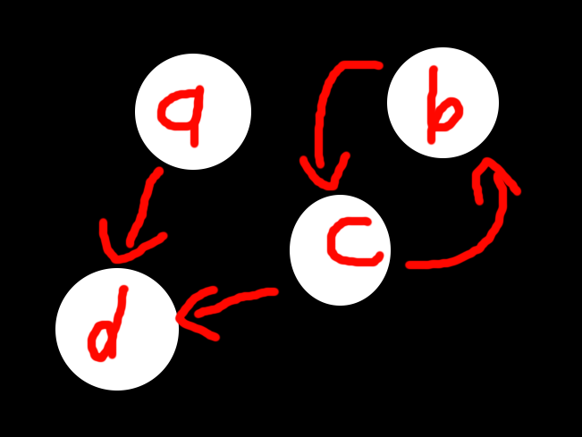

<div align = center>

# MP Parallel Make

[](https://cs341.cs.illinois.edu/assignments/parallel_make.html)

</div>

# Installation

To install, download and extract the tar from the [latest release](https://github.com/Timothy-Gonzalez/timothys-tips/releases/latest):

```sh
curl -sSL https://github.com/Timothy-Gonzalez/timothys-tips/releases/latest/download/cs341-mp-parallel-make.tar | tar -xv
```

# Usage

1. A visual debugger and several tasks are provided
2. The debugger can be used by using the debugging tab in vscode like normal
3. Tasks can be run using `Ctrl + Shift + P > Run Task`
4. Note to test various files with different targets you will need to modify the `args` fields

# Part 1 Tips

- First, pause, take a deep breath, and read the [MP page](https://cs341.cs.illinois.edu/assignments/parallel-make.html) fully.
  Not just part 1. Read everything thoroughly. Yes, it's a lot of work, but you will NOT regret it.
  - Do you know the difference between rules, dependencies, and targets?
  - Do you know what a file rule is?
  - Do you know what a sentinel is?
  - If you don't, **go back and read it again** - you need to know these concepts
- The first step you should take is parsing the Makefile. Note this functionality is given to you.
- Running rules follows toposort. The easiest way to think of this is:
  1.  Start with the leaves (all rules which have no dependencies)
  2.  Run them
  3.  After each rule finishes, mark it's ancestor as having one less dependency.
      If a ancestor rule has no dependencies left, we can execute it next.
- It may be very helpful to have a "rule execution queue" which contains the rules to be executed.
  For part 1, you don't need to worry about parallelization but part 2 will be much easier if
  you think about it and don't "just worry about it later".
- Are you using `targets` more than just once to generate the graph? You shouldn't be. **Make sure you do not use the targets array, as it can be empty!**
  What happens when no targets are passed, and I wonder if the sentinel of the graph might be useful here...
- Make sure you handle cycle detection properly. If a target rule contains a cycle, you should completely ignore it.
  - Printing out is NOT enough. Make sure you are actually ignoring it properly.
  - `testfile7` tests basic cycle detection
  - `testfile8` tests a edge case you need your cycle detection to be careful about
  - I've attached a [`cycles` testfile](./more_testfiles/cycles) under `more_testfiles`.
    It looks like: 
    Note that if I run `./parmake -f more_testfiles/cycles a b` it should output a warning about `b` being cyclic, then only run `d`, then `a`
  - The most common issue I witnessed with the above is that students would still recurse into the c and b ancestors
    - Make sure you do not travel up into ancestors that would be reached by cyclic goals
    - You want to keep track of the valid nodes that are a descendant of your non-cyclic targets, and only run them
- Make sure you handle files properly.
  - You only need special behavior IF AND ONLY IF a rule is a file on the disk, and ALL of it's dependencies are files on the disk
  - File rules run their commands if at least one of the dependency files is newer than the rule file.
  - What syscalls are helpful for this? (Don't just google - it's on the mp page!)
  - Test this! `testfile5` is a great test.
    - First, run the reset
    - Next, run `testfile5`. `examples/newfile` should be created, and the corresponding info will be output.
    - Run it again. No new file output this time - the file will still be there.
    - Now, modify `examples/oldfile` to a different content.
    - When you run `testfile5` again, you should get the new file output.
    - Run it a final time - no new file output.
  - If you don't understand why this behavior is expected - read the explanation above carefully.
  - Note: Even if there are no newer files, and the rule's commands are not run, this dependency still passes and allows the ancestor to run.
- Other than that, **test, test, test**. If you test all of the above & the provided testfiles, you should easily pass.
- Note that `testfile10` and other files that have notes about parallelization won't output in the right order, but you can still verify that the order is correct.

# Part 2 Tips

- If you did part 1 well, part 2 should be simple.
  If you used a shortcut and just put all of the rules into a single vector that is toposorted, you're going to need to change.
- The reason is when we have parallelization, we can't just keep running in a list - we have to wait for rules to fail or succeed.
- First things first, make sure you create j number of worker threads. Note you should NOT be recreating threads - they should only be created once.
- Since we have a bunch of threads that need to run in parallel, we need some kind of thread safe structure like a queue to store tasks for our threads.
  - You CAN use a vector - but you'd have to make sure you implement mutexes correctly with this solution.
    It just has to be thread safe.
- What would our task need to be? What is a single "task" in the context of makefiles.
- What tasks do we start with? What do we need to do after each task we complete?
- Remember from part 1 that we need to find leaves, and then for each of them, run them,
  and then check their ancestors to see if they can now run.
- Do not run ancestors if the rule fails!
- When are we done? In previous labs, we could just add `NULL` to the end, but that doesn't work here. Why?
  - If a rule is still running, are we ALWAYS done?
  - If we have no rules left in the execution queue, are we ALWAYS done?
- Note: Graphs, vectors, etc. are **not thread safe**. Make sure you use mutexes!
- Make sure your code doesn't deadlock! Your code should exit!
- Test with `testfile10`, make sure you can reach around `2.75s`.
  By watching the output you can tell what is being parallelized.
- Test all of your files with multiple thread and without! Make sure you didn't break anything!
